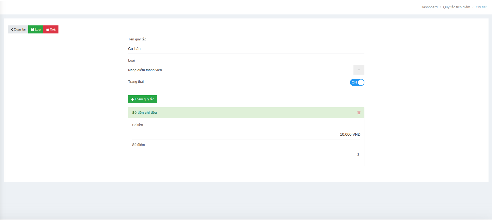

# Danh mục sản phẩm

#### Giao diện danh sách sản phẩm

<figure><figcaption></figcaption></figure>

Màn hình hiển thị danh sách các sản phẩm với các thông tin cơ bản:

* **Mã SP**: Mã định danh sản phẩm, viết liền, in hoa, không dấu.
* **Tên sản phẩm**: Tên đầy đủ của sản phẩm.
* **Bán mang đi**: Đánh dấu nếu sản phẩm có thể bán mang đi.
* **SP**: Xác định đây là sản phẩm chính.
* **DV**: Đánh dấu nếu là dịch vụ.
* **NL**: Đánh dấu nếu là nguyên liệu.
* **Trạng thái**: Hiển thị trạng thái sản phẩm (hoạt động/không hoạt động).

Ngoài ra, giao diện có nút **Tạo mới** để thêm sản phẩm và ô **Tìm kiếm** để tra cứu nhanh sản phẩm trong danh sách.

#### Màn hình tạo mới/chỉnh sửa sản phẩm

<figure><figcaption></figcaption></figure>

Khi tạo mới hoặc chỉnh sửa sản phẩm, hệ thống cho phép nhập và cấu hình các thông tin:

* **Tên sản phẩm**: Tên hiển thị của sản phẩm.
* **Mã hàng hóa**: Mã định danh duy nhất, viết liền, in hoa, không dấu (ví dụ: CF001).
* **Nhóm hàng hóa**: Chọn nhóm danh mục mà sản phẩm thuộc về.
* **Tùy chọn phân loại**:
  * **Bán mang đi**: Cho phép đánh dấu nếu sản phẩm bán để mang đi.
  * **Sản phẩm**: Xác định đây là sản phẩm chính để bán.
  * **Dịch vụ**: Đánh dấu nếu mặt hàng là dịch vụ (không quản lý tồn kho).
  * **Nguyên liệu**: Đánh dấu nếu đây là nguyên liệu dùng để sản xuất hoặc pha chế.

Hệ thống cung cấp các nút thao tác:

* **Lưu**: Lưu thông tin sản phẩm vừa nhập.
* **Xóa**: Xóa sản phẩm khỏi hệ thống.
* **Quay lại**: Trở về danh sách sản phẩm.
