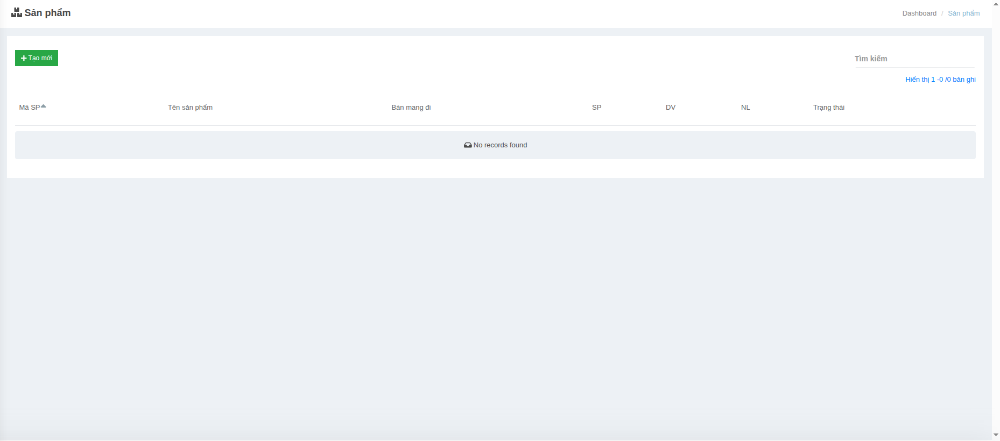

# Quy tắc tích điểm

Giao diện chính

<figure><figcaption></figcaption></figure>

* **Thêm quy tắc**: Nút bấm màu xanh để tạo mới một quy tắc tích điểm.
* **Bảng danh sách** hiển thị các quy tắc đã tạo:
  * **Tên quy tắc**: Tên gọi của quy tắc (ví dụ: Cơ bản, Theo hóa đơn, Theo sản phẩm).
  * **Loại**: Kiểu áp dụng của quy tắc (ví dụ: Nâng điểm, Tích điểm theo %).
  * **Trạng thái**: Hiển thị bật/tắt (✔ đang hoạt động, ✘ đã ngưng).

#### Chức năng

* **Tạo mới**: Người dùng có thể bấm nút **+ Thêm quy tắc** để mở màn hình chi tiết và khai báo thông tin quy tắc.
* **Xem danh sách**: Toàn bộ quy tắc được liệt kê và có thể tìm kiếm, sắp xếp hoặc chỉnh sửa.
* **Kích hoạt / vô hiệu hóa**: Quản lý trạng thái hoạt động của từng quy tắc.

#### Ý nghĩa

* Giúp hệ thống **linh hoạt trong việc tích điểm**: có thể theo giá trị hóa đơn, số lượng sản phẩm, hoặc chương trình khuyến mãi.
* Cho phép doanh nghiệp **tùy biến nhiều cách tính điểm** phù hợp từng ngành hàng hoặc chiến dịch marketing.

### Tạo mới / Chỉnh sửa quy tắc tích điểm

Màn hình này cho phép tạo mới hoặc chỉnh sửa thông tin của một **quy tắc tích điểm** trong hệ thống.

<figure><figcaption></figcaption></figure>

#### Các trường thông tin

* **Tên quy tắc**\*: Tên của quy tắc tích điểm (bắt buộc), ví dụ: Cơ bản, Chi tiêu nâng hạng, Khuyến mãi đặc biệt.
* **Loại**: Xác định mục đích của quy tắc, ví dụ: Nâng điểm thành viên, tích điểm thưởng khi mua hàng, hoặc khuyến mãi theo sự kiện.
* **Trạng thái**: Công tắc bật/tắt để quyết định quy tắc có đang được áp dụng hay không.
* **Điều kiện quy đổi** (có thể thêm nhiều điều kiện):
  * **Số tiền chi tiêu**: Giá trị tiền cần khách hàng thanh toán để được tính điểm (ví dụ: 10.000 VNĐ).
  * **Số điểm**: Điểm được cộng tương ứng với số tiền chi tiêu (ví dụ: 1 điểm).

#### Thao tác

* **Thêm quy tắc**: Thêm một điều kiện quy đổi mới (Số tiền – Số điểm). Có thể thêm nhiều dòng để thiết lập nhiều mức quy đổi khác nhau.
* **Xoá**: Xoá một điều kiện quy đổi trong danh sách.
* **Lưu**: Lưu lại thông tin của quy tắc vừa tạo hoặc chỉnh sửa.
* **Quay lại**: Trở về danh sách quy tắc tích điểm mà không lưu thay đổi.

#### Lợi ích

* Giúp hệ thống tự động tính toán số điểm thưởng cho khách hàng dựa trên hành vi chi tiêu.
* Doanh nghiệp dễ dàng thiết lập nhiều mức quy đổi điểm khác nhau để khuyến khích khách hàng chi tiêu nhiều hơn.
* Là cơ sở để hệ thống nâng hạng hội viên, áp dụng ưu đãi và xây dựng chương trình khách hàng thân thiết.
